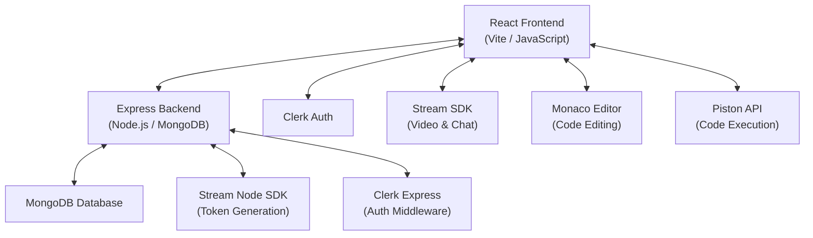

<div align="center">
  
  # 💻 CoDrift
  
  **Code Together · Get Hired**
  
  A real-time collaborative coding and technical interview platform with live video calls, synchronized code editing, and instant multi-language code execution.

  [](https://codrift-green.vercel.app/)
  [](https://react.dev/)
  [](https://tailwindcss.com/)
  [](https://nodejs.org/)
  [](https://www.mongodb.com/)
  [](https://getstream.io/)

</div>

---

## 📌 Overview

**CoDrift** is a modern, full-stack platform designed to simulate real-world technical interviews and collaborative pair-programming sessions. It features a fully synchronized real-time code editor, integrated HD video and audio calling, and live code execution supporting multiple programming languages.

Whether you are practicing algorithms solo, conducting a mock interview with a peer, or evaluating a candidate — CoDrift provides a seamless, distraction-free workspace.

## 🏗️ Architecture



## ✨ Features

| Feature | Description |
|---------|-------------|
| 🧑‍💻 **Real-Time Collaborative Editor** | Write and edit code simultaneously with your peers using the integrated Monaco Editor (the same editor powering VS Code) |
| 🎥 **HD Video & Audio Calls** | Face-to-face communication without leaving the platform, powered by Stream Video SDK |
| 💬 **Live Session Chat** | In-session messaging with unread badges, real-time delivery, and threaded conversations |
| ⚡ **Multi-Language Code Execution** | Compile and run code in JavaScript, Python, C++, Java and more instantly via the Piston API |
| 📚 **Curated Problem Library** | Built-in problem set with search, difficulty filters (Easy/Medium/Hard), and category browsing |
| 🎛️ **Resizable Workspace Panels** | Drag to resize the code editor, problem description, console output, and video panels to your preference |
| 🔐 **Secure Authentication** | Seamless sign-in and session management powered by Clerk |
| 🛡️ **Secure Interview Mode** | Fullscreen lockdown with copy/paste and keyboard shortcut blocking for proctored sessions |
| 🎊 **Test Case Validation** | Auto-checks your output against expected results with confetti celebration on success |
| 👨‍💼 **Admin Portal** | Secure dashboard for administrators to add, edit, and manage coding problems |
| 🐳 **Docker Support** | One-command deployment with Docker Compose |

## 🛠️ Tech Stack

### Frontend (`/frontend`)
- **React 19** — UI library
- **Vite** — Lightning-fast build tool
- **Tailwind CSS v4** + **DaisyUI** — Utility-first styling with component library
- **Framer Motion** — Smooth page transitions and micro-animations
- **Monaco Editor** (`@monaco-editor/react`) — VS Code-powered code editor
- **Stream Video SDK** — Real-time video and audio
- **Stream Chat SDK** — In-session messaging
- **Clerk** (`@clerk/clerk-react`) — Authentication
- **TanStack React Query** — Server state management
- **React Router v7** — Client-side routing
- **react-resizable-panels** — Draggable workspace layout
- **Recharts** — Data visualization
- **Lucide React** — Icon library
- **canvas-confetti** — Success celebrations 🎊

### Backend (`/backend`)
- **Node.js** + **Express 5** — REST API server
- **MongoDB** + **Mongoose** — Database and ODM
- **Clerk** (`@clerk/express`) — Auth middleware
- **Stream Node SDK** — Video/chat token generation
- **Inngest** — Background job processing

### External Services
- **[Clerk](https://clerk.com/)** — User authentication & session management
- **[Stream](https://getstream.io/)** — Video calling & chat infrastructure
- **[Piston API](https://github.com/engineer-man/piston)** — Sandboxed multi-language code execution


## 🚀 Getting Started

### Prerequisites

- [Node.js](https://nodejs.org/) (v20+)
- [MongoDB](https://www.mongodb.com/) (local or Atlas)
- API keys for [Clerk](https://clerk.com/) and [Stream](https://getstream.io/)

### 1. Clone the Repository

```bash
git clone https://github.com/raghavmishra8382/Codrift.git
cd Codrift
```

### 2. Setup the Backend (`/backend`)

```bash
cd backend
npm install
```

Create a `.env` file in the `backend/` directory:

```env
PORT=5000
MONGO_URI=your_mongodb_connection_string
CLERK_PUBLISHABLE_KEY=your_clerk_publishable_key
CLERK_SECRET_KEY=your_clerk_secret_key
STREAM_API_KEY=your_stream_api_key
STREAM_API_SECRET=your_stream_api_secret
```

Start the backend server:

```bash
npm run dev
```

### 3. Setup the Frontend (`/frontend`)

```bash
cd frontend
npm install
```

Create a `.env.local` file in the `frontend/` directory:

```env
VITE_CLERK_PUBLISHABLE_KEY=your_clerk_publishable_key
VITE_STREAM_API_KEY=your_stream_api_key
VITE_API_URL=http://localhost:5000/api
```

Start the frontend:

```bash
npm run dev
```

### 4. Open the App

Visit **http://localhost:5173** in your browser.

### 🐳 Docker (Alternative)

```bash
docker compose -f docker-compose.dev.yml up --build
```

## ⚙️ Environment Variables Reference

| Service | Variable | Required | Default | Description |
|---------|----------|----------|---------|-------------|
| **Backend** | `PORT` | No | `5000` | Express server port |
| **Backend** | `MONGO_URI` | Yes | — | MongoDB connection string |
| **Backend** | `CLERK_PUBLISHABLE_KEY` | Yes | — | Clerk publishable API key |
| **Backend** | `CLERK_SECRET_KEY` | Yes | — | Clerk secret API key |
| **Backend** | `STREAM_API_KEY` | Yes | — | Stream API key |
| **Backend** | `STREAM_API_SECRET` | Yes | — | Stream API secret |
| **Frontend** | `VITE_CLERK_PUBLISHABLE_KEY` | Yes | — | Clerk publishable key |
| **Frontend** | `VITE_STREAM_API_KEY` | Yes | — | Stream API key |
| **Frontend** | `VITE_API_URL` | Yes | — | Backend API base URL |

## 🎨 Design System

CoDrift uses a custom dark-mode design system with brand tokens defined in `index.css`:

| Token | Value | Usage |
|-------|-------|-------|
| `brand-bg` | `#09090B` | Main background |
| `brand-surface` | `#111827` | Cards, panels |
| `brand-primary` | `#4F46E5` | Primary accent (Indigo) |
| `brand-secondary` | `#06B6D4` | Secondary accent (Cyan) |
| `brand-text` | `#F8FAFC` | Primary text |
| `brand-muted` | `#94A3B8` | Secondary text |
| `brand-border` | `#27272A` | Borders & dividers |

Font: **Outfit** (Google Fonts)

## 🤝 Contributing

Contributions, issues, and feature requests are welcome!

1. Fork the repository
2. Create your feature branch (`git checkout -b feature/amazing-feature`)
3. Commit your changes (`git commit -m 'Add amazing feature'`)
4. Push to the branch (`git push origin feature/amazing-feature`)
5. Open a Pull Request

## 📄 License

This project is licensed under the ISC License.

---

